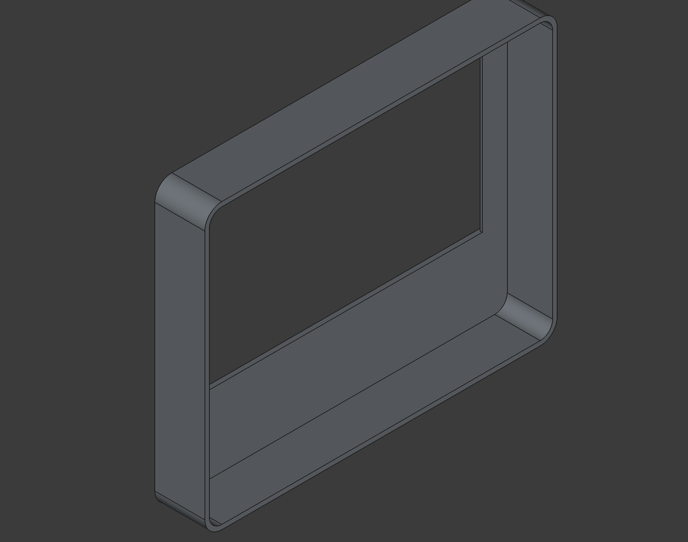
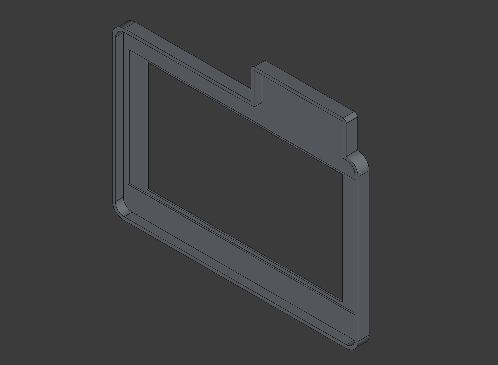
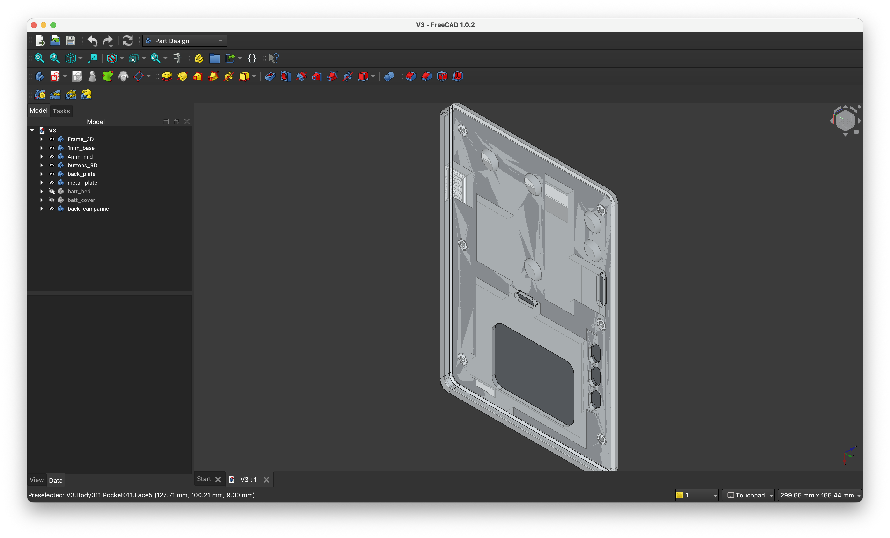

# kenzo-linux-tablet

This project documents the transformation of a Xiaomi Redmi Note 3 (Device Code: *Kenzo*) into a modular Linux-based phablet terminal running **Ubuntu Touch**. The project covers the complete pipeline from low-level bootloader unlocking to custom CAD chassis design for advanced hardware modulation.

---

## Phase 1: Software Pipeline & Bootloader Unlocking

Transforming a commercial Android device into a native Linux machine required bypassing locked manufacturer security layers:

1. **OEM Authorization:** Obtained official cryptographic unlocking permissions from Xiaomi link servers via the Mi Account system to unlock the device's bootloader.
2. **Fastboot Access:** Intercepted the boot execution loop to force the Qualcomm Snapdragon processor into `Fastboot` utility mode.
3. **Flashing Kernel & OS:** Replaced the stock Android partition table, flashing custom recovery images to natively boot **Ubuntu Touch (Linux)** onto the internal storage arm.

---

## Phase 2: CAD Chassis Design (FreeCAD)

To transform the phone form factor into a truly modular workstation, the chassis underwent **three major design iterations** in FreeCAD towards different power profiles and accessory attachments:

### Design 1: Bulky Design
- **Concept:** Designed with a thick box like structure, intended to house an oversized, high-capacity internal battery pack for extended fieldwork.
- **Limitation:** The internal volume was too static, making the unit bulky when extra battery capacity wasn't required. Adding unnecessary weight and space inside.

### Design 2: The Semi-Modular Design
- **Concept:** Integrated custom **magnetic Pogo-pin connectors** into the backplate to support hot-swappable external batteries.
- **Features:** Included a hardwired internal ESP32 microcontroller inside the casing connected directly to the phone's internal USB line for wireless sniffing and peripheral control.

### Design 3: The Modular Design
- **Concept:** The finalized design with both the power system and the accessory port via magnetic pogo pins to make the phablet infinitely upgradeable.
- **Features:**
  - **Modular Power:** External battery units snap on instantly using high-retention magnetic Pogo pins.
  - **Modular Peripherals:** The internal USB data lines terminate at an exposed magnetic Pogo interface. The ESP32 is now in its own hot-swappable cartridge, allowing the user to switch between a microcontroller node, a sensor array, or other future custom attachments.

**The Limitations/Challenges**
- The Power alone is the biggest challange, adding external battery needs to be very regulated for the Battery regulator board that is attached in the battery of the phone. 
- In project i used 18650 Batteries for there minimal voltage rating and higher capacity though make sure that it doesnt not reverse charge when the phablet is pluged in because the battery regulator charges the battery at higher voltage than 18650 batteries are rathed for.
- The Ubuntu Touch itself is not develoved completeled and is terminated. There are limited usages of this phablet due to software and hardware raw power. [For further details Click here](https://devices.ubuntu-touch.io/device/kenzo/release/xenial/).

---

## 📁 Repository Contents
- `/CAD_Files` - Step-by-step FreeCAD assembly revisions showing all 3 design iterations.
- `/Final_desgin` - CAD files/DXF files for the Final desgins.

**Any comment on improvment and errors would be appreciated, feel free to look around.**
